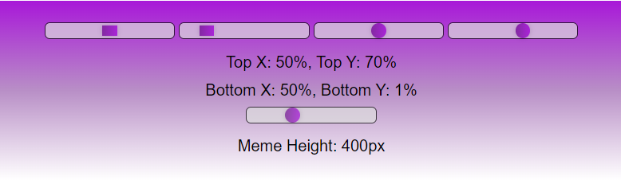
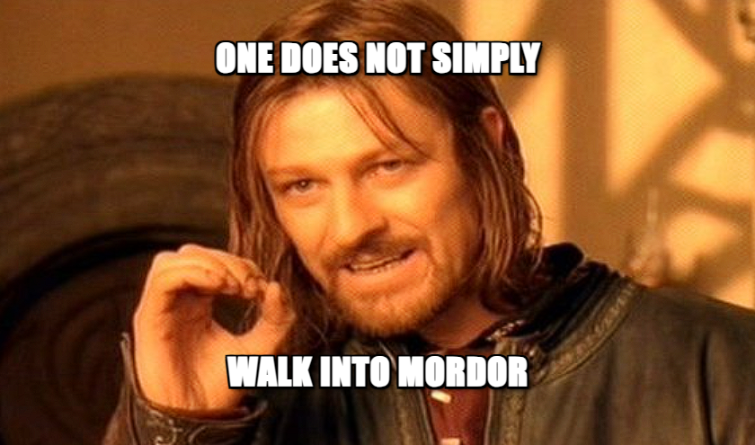

<<<<<<< HEAD
<h1 align="center" id="title">Memes Generator</h1>

<p align="center">
  
</p>

<p id="description">
Memes generator is an online meme creator where you could pick a random meme from up to top 100 most popular memes from the internet and be creative with your text inputs in order to make the one meme everyone from your friends group will love!
</p>

<h2 align="center">Visit here</h2>

<div align="center">
  <a href="https://gigi-codeace.github.io/Memes-generator/">github.io/Memes-Generator</a>
</div>

<h2 align="center">🧐 Features</h2>

<h4>Here're some of the project's best features</h4>

*   User friendly text editing
*   A very large scale of memes to choose from
*   Snippet of code from the percentage text positions:

```javascript
// ...
    function RangeInput(id, min, max, value, onChange, className) {
        return (
            <input
                type="range"
                id={id}
                min={min}
                max={max}
                value={value}
                onChange={onChange}
                className={className}
            />
        );
    }

    return (
        <>
        <div className="slider-container">
        {RangeInput('bottomX', 30, 70, bottomAxis[0], handleBottomX, 'custom-range-square')}
        {RangeInput('bottomY', -5, 30, bottomAxis[1], handleBottomY, 'custom-range-square')}
        {RangeInput('topX', 30, 70, topAxis[0], handleTopX, 'custom-range-circle')}
        {RangeInput('topY', 50, 84, topAxis[1], handleTopY, 'custom-range-circle')}

            <div className="textSwitches">
                <span className="slider-value" id="top-label">
                    Top X: {topAxis[0]}%, Top Y: {topAxis[1]}%
                </span>
                <span className="slider-value" id="bottom-label">
                    Bottom X: {bottomAxis[0]}%, Bottom Y: {bottomAxis[1]}%
                </span>
            </div>

            {RangeInput('memeHeight', 300, 600, memeHeight, handleMemeHeight, 'custom-range-circle')}
            <span className="slider-value" id="meme-height-label">
                Meme Height: {memeHeight}px
            </span>
        </div>
// ...
```
<h2 align="center">Project Screenshots:</h2>
<div align="center">
<h3>Text editing user interface</h3>
 
<h3>Meme sample</h3>
  
</div><br></br>

[](https://www.gigicodeace.com)
[](https://www.linkedin.com/in/dobre-robert-03653b331/)
[](https://github.com/GIGI-CodeAce)
[](https://cssbattle.dev/player/gigi)

  <b></b>
   <h4>~GIGI <code>Dore Robert</code></h4>
</footer>